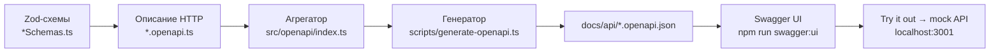

# OpenAPI и Swagger — как это устроено

Краткая инструкция: от Zod-схем до Swagger UI.

## Главная идея

В проекте **один источник правды — Zod-схемы** в коде приложений.

Из них генерируются JSON-файлы OpenAPI. Swagger UI **не знает про Zod** — он читает только готовые `.json` из `docs/api/`.



---

## Файлы и роли

| Что | Где | Зачем |
|-----|-----|-------|
| Zod-схемы данных | `apps/<app>/src/modules/.../*Schemas.ts` | Валидация ответов API в рантайме |
| Описание эндпоинтов | `apps/<app>/src/modules/.../*.openapi.ts` | Метод, URL, query, response |
| Список маршрутов приложения | `apps/<app>/src/openapi/index.ts` | Собирает все `*.openapi.ts` модуля |
| Генератор | `scripts/generate-openapi.ts` | Собирает JSON для каждого приложения |
| Спеки | `docs/api/operator.openapi.json` и т.д. | Готовый контракт для Swagger / бэка |
| Swagger UI | `docs/swagger/index.html` + `scripts/serve-swagger.mjs` | Локальный просмотрщик (не в билде приложения) |

**Важно:** из одной Zod-схемы нельзя угадать HTTP-метод и URL. Поэтому схемы и маршруты разделены:

- `incidentsSchemas.ts` — **что** приходит в JSON
- `incidents.openapi.ts` — **как** это получить (`GET /incidentsTree`)

---

## Как Swagger берёт API-файлы

1. Запускаете `npm run swagger:ui` → стартует `scripts/serve-swagger.mjs` на порту **5179**.
2. Браузер открывает `http://localhost:5179` → сервер отдаёт `docs/swagger/index.html`.
3. В HTML есть `<select>` с путями:
   - `/api/operator.openapi.json`
   - `/api/admin.openapi.json`
   - `/api/expert.openapi.json`
4. Swagger UI по выбранному URL запрашивает JSON у того же сервера.
5. Сервер отдаёт файлы из папки `docs/api/`.

При **Try it out** Swagger шлёт запрос, например `GET /incidentsTree`. Если такого статического файла нет, `serve-swagger.mjs` **проксирует** запрос на mock API (`http://localhost:3001`).

Итого: Swagger читает **сгенерированные JSON**, а живые запросы идут на **mock-сервер**.

---

## Быстрый старт

### 1. Сгенерировать OpenAPI из схем

Из корня репозитория:

```bash
# все 3 приложения
npm run openapi:generate

# только operator
npm run openapi:generate:operator
```

Результат:

- `docs/api/operator.openapi.json`
- `docs/api/admin.openapi.json`
- `docs/api/expert.openapi.json`

### 2. Открыть Swagger UI локально

**Терминал 1** — mock API (для Try it out):

```bash
npm run mock:server
```

**Терминал 2** — Swagger:

```bash
npm run swagger:ui
```

Открыть: **http://localhost:5179**

Если порт занят (`EADDRINUSE`):

```powershell
$env:SWAGGER_PORT=5180; npm run swagger:ui
```

### 3. Собрать статику для отдельного деплоя

```bash
npm run openapi:generate
npm run swagger:build
```

Результат: `docs/swagger/dist/` — можно выложить на внутренний хост. В production-билде operator/admin/expert Swagger **не попадает**.

---

## Как добавить новый эндпоинт

Пример для `app-operator`. Для admin/expert — та же схема, другая папка.

### Шаг 1. Zod-схема (`*Schemas.ts`)

```ts
// apps/app-operator/src/modules/users/api/usersSchemas.ts
import { z } from 'zod';

export const UserSchema = z.object({
  id: z.string(),
  name: z.string(),
});

export const UsersListResponseSchema = z.array(UserSchema);
```

Схема используется и для `parse()` в коде, и для генерации OpenAPI.

### Шаг 2. Описание HTTP (`*.openapi.ts`)

```ts
// apps/app-operator/src/modules/users/api/users.openapi.ts
import type { OpenApiRouteDefinition } from '../../../../../../scripts/openapi/types';
import { UsersListResponseSchema } from './usersSchemas';

export const usersOpenApiRoutes = [
  {
    method: 'get',
    path: '/users',
    tags: ['Users'],
    summary: 'Список пользователей',
    operationId: 'getUsers',
    responses: {
      200: {
        description: 'OK',
        schema: UsersListResponseSchema,
      },
    },
  },
] satisfies OpenApiRouteDefinition[];
```

Для query-параметров, body, path-params — поле `request`:

```ts
request: {
  query: z.object({ page: z.number().optional() }),
  params: z.object({ id: z.string() }),
  body: CreateUserSchema,
},
```

### Шаг 3. Подключить в агрегатор

```ts
// apps/app-operator/src/openapi/index.ts
import { incidentsOpenApiRoutes } from '../modules/incidents/api/incidents.openapi';
import { usersOpenApiRoutes } from '../modules/users/api/users.openapi';

export const openApiRoutes = [
  ...incidentsOpenApiRoutes,
  ...usersOpenApiRoutes,
];
```

### Шаг 4. Перегенерировать и проверить

```bash
npm run openapi:generate:operator
npm run swagger:ui
```

В Swagger выберите **Operator API** — новый эндпоинт появится в списке.

---

## Рекурсивные схемы (деревья)

Для рекурсивных структур (`children` внутри того же типа) в Zod нужен `z.lazy()` и `meta({ id: '...' })`:

```ts
export const IncidentTreeNodeSchema = z.lazy(() =>
  z.object({
    id: z.string(),
    children: z.array(IncidentTreeNodeSchema).optional(),
  }).meta({
    id: 'IncidentTreeNode', // обязательно для рекурсии в OpenAPI
    description: 'Узел дерева',
  }),
);
```

В сгенерированном JSON появится `$ref` на `#/components/schemas/IncidentTreeNode` — это нормально.

---

## npm-скрипты

| Команда | Что делает |
|---------|------------|
| `openapi:generate` | Генерирует JSON для operator, admin, expert |
| `openapi:generate:operator` | Только operator |
| `openapi:generate:admin` | Только admin |
| `openapi:generate:expert` | Только expert |
| `swagger:ui` | Локальный Swagger на :5179 |
| `swagger:build` | Статический сайт в `docs/swagger/dist` |
| `mock:server` | Mock API на :3001 для Try it out |

---

## Частые вопросы

**Swagger не стартует / порт занят**  
Порт 5179 уже занят предыдущим запуском. Откройте `http://localhost:5179` или смените порт через `SWAGGER_PORT`.

**Try it out возвращает ошибку**  
Поднимите `npm run mock:server`. Без него прокси на :3001 не ответит.

**Изменил схему, в Swagger старое**  
Сначала `npm run openapi:generate`, потом обновите страницу Swagger (F5).

**Пользователи увидят Swagger в проде?**  
Нет. Swagger вынесен из приложений в отдельный `docs/swagger/`.

**Чем это отличается от `openapi.draft.yaml`?**  
`openapi.draft.yaml` — ручной черновик по макетам. `docs/api/*.openapi.json` — автогенерация из реальных Zod-схем фронта.
